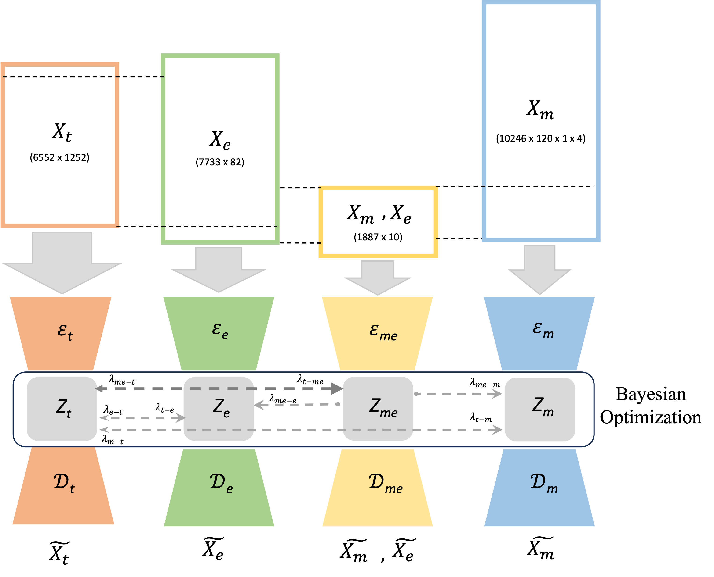

### Coupled autoencoders for M, E, and T analysis

Objectives:
 - Joint analysis of Morphology, Electrophysiology, and Transcriptomic data from Patch-seq, ME, fMOST and EM experiments.
 - Extending results from Patch-seq dataset to EM reconstructions

### Data
 - Patch-seq dataset for V1 cortical excitatory and inhibitory neurons ([Gala et al. 2021](https://www.nature.com/articles/s43588-021-00030-1), [Gouwens et al. 2020](https://www.sciencedirect.com/science/article/pii/S009286742031254X): 6614 cells
 - ME (morpho-electric) dataset: 1909 cells
 - fMOST (full morphology) dataset: 280 cells
 - EM (electron-microscopy) dataset: 43455 cells.

### Environment

1. Navigate to the `cplAE_MET` folder with the `setup.py` file.
2. Create the conda environment with the main dependencies.
```bash
conda create -n cplAE_MET
conda activate cplAE_MET
conda install python=3.8
conda install pytorch torchvision torchaudio cudatoolkit=11.3 -c pytorch #see system specific instructions
pip install scikit-learn jupyterlab seaborn pandas rich tqdm timebudget statsmodels umap-learn
pip install tensorboard
```
3. Install the development version of this repository
```bash
pip install -e .
```
4. Install the `cplAE_TE` repository after cloning it.
```bash
# can do this within any directory on local machine
git clone https://github.com/AllenInstitute/coupledAE-patchseq
cd coupledAE-patchseq
pip install -e .
```

### Additional repositories
 - [celltype_hierarchy](https://github.com/AllenInstitute/celltype_hierarchy) - Helpers for dendrogram manipulation
 - [cplAE_TE](https://github.com/AllenInstitute/coupledAE-patchseq) - Coupled autoencoders for T and E

### Config
```toml
# config.toml contents
package_dir = "/home/fahimehb/Local/code/cplAE_MET/"
MET_data = "/allen/programs/celltypes/workgroups/mousecelltypes/MachineLearning/Patchseq-Exc/dat/MET_M120x4_13k_25Jul23.mat"
```

```
# config_preproc.toml contents
package_dir = '/home/fahimehb/Local/new_codes/cplAE_MET/'
data_dir = '/allen/programs/celltypes/workgroups/mousecelltypes/MachineLearning/Patchseq-Exc/dat/'

#For T
#specimen id file should be provided and is located in the data_dir
specimen_ids_file = "exc_inh_ME_fMOST_qc_passed_EM_specimen_ids_16k_shuffled_28June23.txt" 
#gene ids and their beta_score should be provided and is located in the data_dir  
gene_file = "good_genes_beta_score.csv"  
# This is one the output of the data_proc_T.py and will be saved in data_dir
t_data_output_file = "T_data_50k_4Apr23.csv" 
# This is one of the output of data_proc_T.py and will be saved in data_dir
t_anno_output_file = "T_anno_50k_4Apr23.csv"
# This is one of the output of data_proc_T.py and will be saved in data_dir
gene_id_output_file = "gene_ids_28Sep22.csv"

#For M
# This is m data folder and is located in data_dir
m_data_folder = 'm_data'
# This is the annotation file for m data and is located in m_data folder in data_dir
m_anno = 'm_anno_30Mar23.csv'
# This is the folder which contains all the arbor densities for all the cells and inside the m_data folder in data_dir
hist2d_120x4_folder = 'hist2d_120x4'
# This is the output of data_proc_M.py and will be saved in data_dir
arbor_density_file = 'M_arbor_data_50k_4Apr23.mat'

#For E
#This file contains the E time series and should be provided and located in the data_dir
E_timeseries_file = "fv_Ephys_timeseries_12Dec22.h5"
#This file is contains ipfx data for all the E cells and should be provided and located in data_dir
ipfx_features_file = "ipfx_features_12Dec22.csv"
#This is the output of data_proc_E.py and will be saved in data_dir
e_output_file = "E_data_50k_4Apr23.csv"

#For MET
# data_proc_MET.py will use all the output of data_proc_T.py, data_proc_E.py and data_proc_M.py to 
# generate the following output which is saved in data_dir and is the input for the machine learning model
met_output_file = "MET_M120x4_50k_4Apr23.mat"
```

### Contributors
Fahimeh Baftizadeh, Rohan Gala
