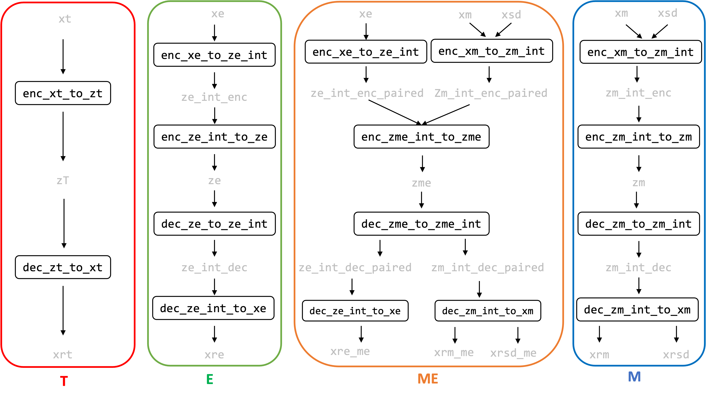

 

#### bayesian_optimization_conv.py:
Training code with the option to run bayesian optimization.

#### model_classes.py:
Triple modalities coupled AE model

#### subnetworks_T.py:
T autoencoder arm which includes the following modules from the fig above:
```
- enc_xt_to_zt: T encoder module
- dec_zt_to_xt: T decoder module
```
#### subnetworks_E.py:
E autoencoder arm which is consist of 4 module (2 modules for encoding and 2 module for decoding). enc_xe_to_ze_int is the first encoding module, its weights will be copied and used for the ME arm as well. enc_ze_int_to_ze(see in the fig above) is the second encoding module and is specific to the E autoencoder arm.


